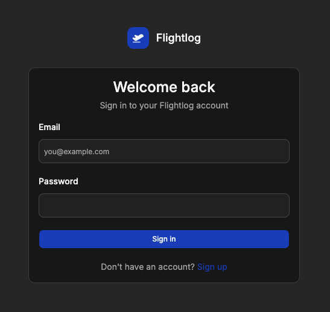
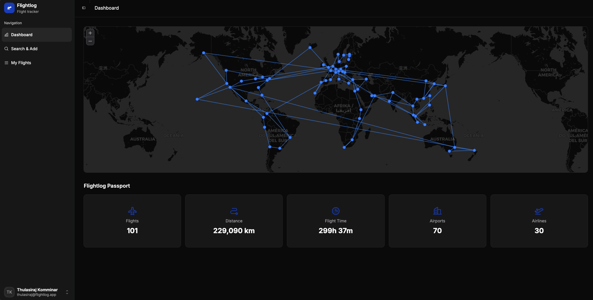
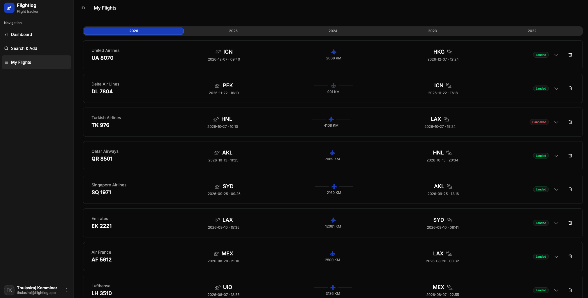
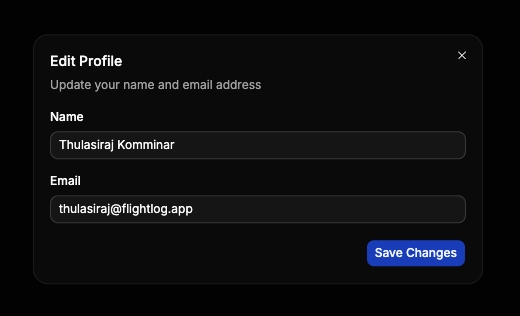

<!-- LOGO -->
<!-- markdownlint-disable MD033 -->
<h1>
<p align="center">
  
  <br>Flightlog
</p>
</h1>
<!-- markdownlint-enable MD033 -->

A simple app to track and manage your flight history.

## Screenshots











## Getting Started

### Flight Data Provider

Flightlog uses [AeroDataBox](https://aerodatabox.com) via [RapidAPI](https://rapidapi.com/aedbx-aedbx/api/aerodatabox) to fetch flight data. It calls the [Get Flight on Specific Date](https://doc.aerodatabox.com/rapidapi.html#/operations/GetFlight_FlightOnSpecificDate) endpoint and caches results locally in SQLite to minimize API usage.

To get an API key:

1. Sign up at [rapidapi.com](https://rapidapi.com)
2. Subscribe to [AeroDataBox](https://rapidapi.com/aedbx-aedbx/api/aerodatabox) (free tier available)
3. Copy your **X-RapidAPI-Key**

### Configuration

Copy `.env.example` to `.env` and set the required values.

#### Required

| Variable | Description |
| --- | --- |
| `AERODATABOX_API_KEY` | Your RapidAPI key from the step above |
| `AUTH_JWT_SECRET` | Secret for signing JWT tokens (`openssl rand -base64 32`) |

#### Optional

| Variable | Default | Description |
| --- | --- | --- |
| `ENVIRONMENT` | `development` | Set to `production` in prod |
| `SERVER_PORT` | `8080` | HTTP port |
| `DATABASE_PATH` | `data/flightlog.db` | SQLite database path |
| `AUTH_TOKEN_EXPIRY` | `24h` | JWT token lifetime |
| `RATE_LIMIT_IP_REQUESTS_PER_MINUTE` | `100` | Per-IP rate limit |
| `RATE_LIMIT_USER_REQUESTS_PER_MINUTE` | `200` | Per-user rate limit |
| `AERODATABOX_BASE_URL` | `https://aerodatabox.p.rapidapi.com` | API base URL |
| `AERODATABOX_TIMEOUT` | `30s` | API request timeout |
| `LOG_LEVEL` | `info` | `debug`, `info`, `warn`, `error` |

### Deployment

Create a `docker-compose.yml`:

```yaml
services:
  flightlog:
    image: ghcr.io/thulasirajkomminar/flightlog:latest
    env_file: .env
    ports:
      - 8080:8080
    volumes:
      - flightlog_data:/data
    restart: unless-stopped
volumes:
  flightlog_data:
```

```bash
docker compose up -d
```
