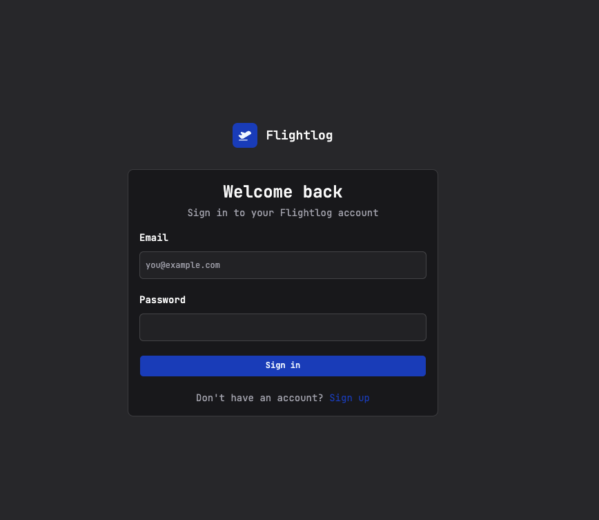

# Accounts & signing in

Flightlog is a single-tenant app in spirit but supports multiple accounts — useful if you share an instance with a partner or family member who wants their own logbook.

## Creating your account

The first time you open Flightlog you'll land on the **Sign in** screen above. There's no separate admin step or invite flow — just:

1. Click **Sign up** at the bottom of the card.
2. Enter your email and a password.
3. You're in. The next time you visit, sign in with the same credentials.

That's the entire account setup. Sessions are signed with the `AUTH_JWT_SECRET` you set during deployment, so they survive container restarts but will all log out if you rotate that secret.

## Each account = its own logbook

Flights, dashboard totals, imports and exports are all scoped to the signed-in user. Two accounts on the same instance share:

- The **AeroDataBox cache** — if account A looks up `BA 117 on 2026-04-12` and account B does the same search later, B gets the cached result and **no extra API call is made**. Helpful for shared households.
- Nothing else. Account A can't see account B's flights, totals, or exports.

## Forgetting a password

There's no self-serve password reset today — the simplest recovery is to drop into the SQLite database and reset the password hash manually, or just create a new account. If you're the only user on the instance and you're stuck, ping me on the [GitHub issue tracker](https://github.com/thulasirajkomminar/flightlog/issues) and I'll help you out.

!!! tip "Use a password manager"
    Since there's no reset email flow, treat your Flightlog credentials like any other self-hosted app — store the password in 1Password / Bitwarden / your manager of choice and you'll never have to think about it again.
