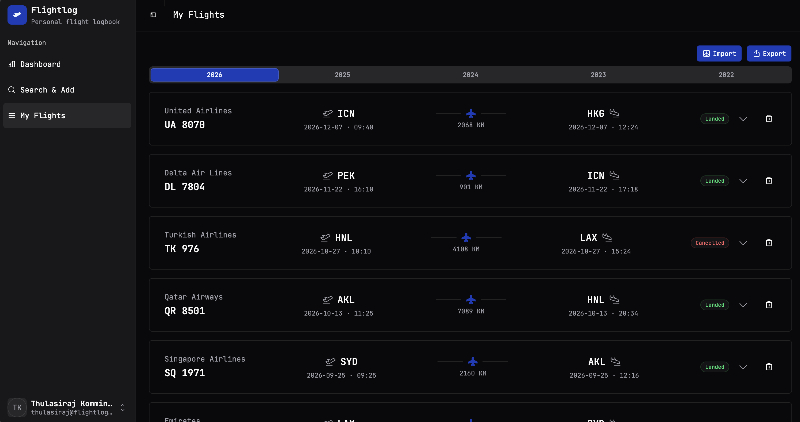

# My Flights

The full logbook lives here — every flight you've ever saved, grouped by year, sorted from most recent to oldest.

## Year tabs

The row of years across the top is a quick filter. Click a year to scope the list below to that year only — handy when you want to see "how much did I fly in 2024?" without scrolling.

The currently selected year is highlighted in the brand blue; years with no flights still show in the tab strip, just dimmed.

## The flight rows

Each row is a one-line summary of a flight:

- **Airline + flight number** on the far left
- **Origin** IATA, with date and local departure time
- **Distance** in km, with a small aeroplane icon for visual orientation
- **Destination** IATA, with date and local arrival time
- **Status badge** — `Landed`, `Cancelled`, etc.
- **Chevron** to expand the row
- **Trash icon** to delete the flight

## Expanding a row

Click the chevron on the right-hand side of any row and it opens up to show the full detail — the same view you saw on the Search & Add page when you originally saved it: terminals, gates, scheduled vs runway times, aircraft type, UTC times, the lot.

This is the cached snapshot from the moment you added the flight. Flightlog **doesn't re-poll AeroDataBox** to refresh historical flights — once it's in your log, it stays exactly the way it was when you saved it. Which is usually what you want for a historical record, but worth knowing if a flight was still in the air when you added it.

## Deleting a flight

The trash icon prompts for confirmation, then removes the flight permanently. The dashboard totals update immediately to reflect the deletion.

If you delete by accident: the only "undo" is to re-search and re-add. Flightlog doesn't keep a tombstone.

!!! warning "There's no soft-delete"
    Deletion is final. If you're about to do a big cleanup and you're not 100% sure, **export your data first** ([Export](import-export.md#export)). The CSV is your backup — you can re-import it later if you change your mind.

## Import & Export buttons

The top-right of the page holds the two data-portability buttons:

- **Import** — bring flights in from a Flighty CSV or a previous Flightlog export.
- **Export** — dump your entire logbook to a CSV file.

Both are covered in detail on the [Import & Export](import-export.md) page.
