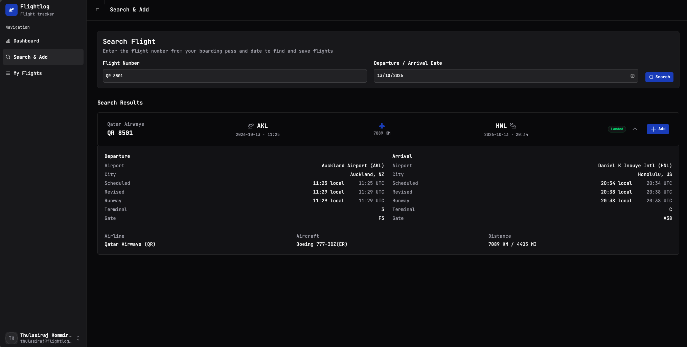

# Search & add flights

This is where flights actually get into your log. You give Flightlog a flight number and a date, it asks AeroDataBox what happened, and you decide whether to save the result.

## The two inputs

**Flight Number** — exactly as it appears on your boarding pass. Both formats work:

- `QR 8501` (space-separated)
- `QR8501` (no space)
- `qr8501` (lowercase)

The carrier code (`QR`, `BA`, `KL`…) is required — AeroDataBox uses it to disambiguate codeshares.

**Departure / Arrival Date** — the date of departure in the local time of the origin airport. If you're flying overnight and arrive on the next calendar date, **use the departure date**, not the arrival date.

Hit **Search** and the result usually comes back in under a second (faster on subsequent searches, since lookups are cached locally).

## Reading the search result

Each result card has three rows of info:

1. **Header row** — airline, flight number, status badge (`Landed`, `Cancelled`, `Scheduled`, `Diverted`...) and an **Add** button.
2. **Route summary** — origin and destination IATA codes, with the distance between them and an aeroplane icon to suggest direction of travel.
3. **The expanded detail** — Departure on the left, Arrival on the right, with:
   - Airport name and city
   - **Scheduled** vs **Revised** vs **Runway** times (so you can see at a glance if your flight was delayed or arrived early)
   - Local time _and_ UTC for every time field
   - Terminal and gate
   - Aircraft type and the total distance flown

## When the search returns nothing

Three common reasons:

- **The date is too far in the future or the past.** AeroDataBox has a window of roughly +7 days to −12 months for the free tier. Outside that, you'll get an empty result.
- **The flight number is wrong.** Easy to mistype — double-check the carrier code (it's the two-letter prefix).
- **The flight was cancelled before the day-of and never showed in operational data.** Rare, but it happens. You can still record it manually by [importing a CSV](import-export.md#import).

## Saving the flight

Hit the **Add** button in the top-right of the result card. The flight moves into your logbook and shows up immediately on the [Dashboard](dashboard.md) map and in [My Flights](my-flights.md). The button changes state so you know it's saved.

You can add the same flight number on different dates as separate entries — Flightlog won't deduplicate those, because flying `BA 117 JFK→LHR` twice in the same month is genuinely two flights.

!!! tip "Boarding pass on your phone? Add the flight in seconds"
    The fastest workflow I've found: pull up your boarding pass, glance at the flight number and date, switch to Flightlog on the same phone, type six characters, tap Add. Whole thing takes about ten seconds and you never have to remember to log it later.
